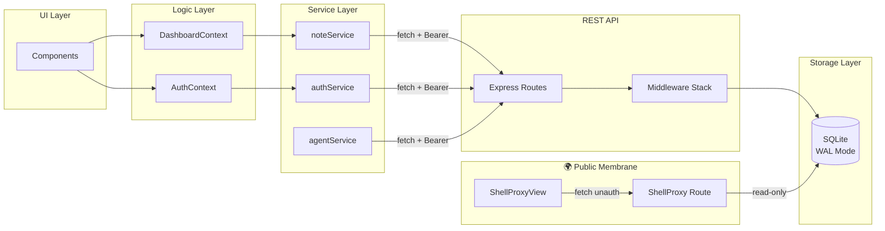
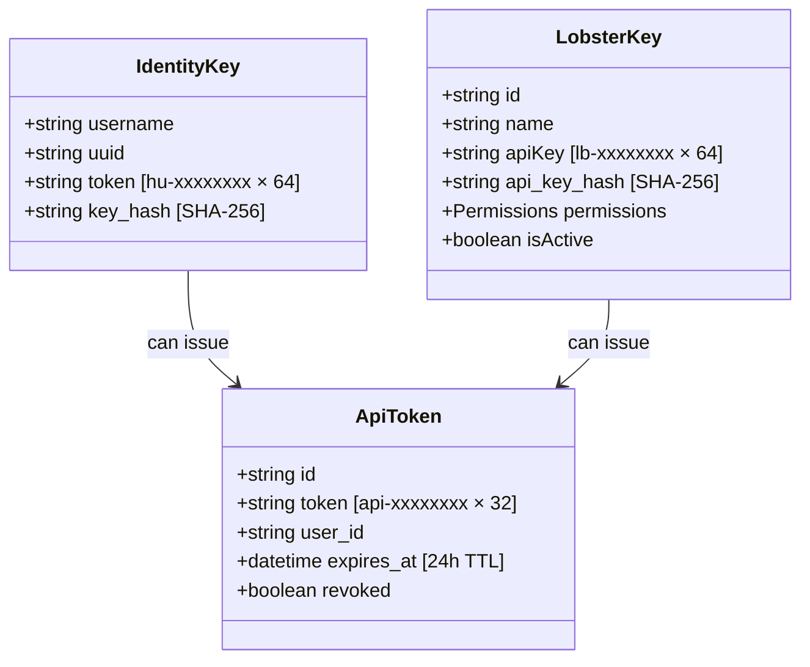
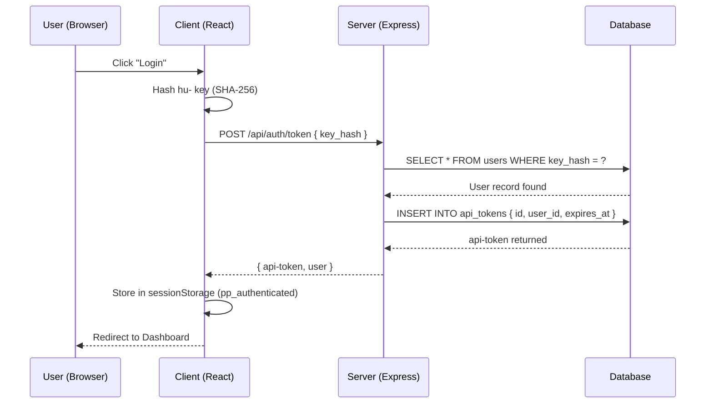

# 🏗️ System Blueprint: PinchPad

[](#)
[](#)

> ASCII Construction Blueprint — the authoritative structural reference for PinchPad.

---

## Full Directory Tree

```text
PinchPad/
│
├── 📄 index.html                    # Vite HTML entry point
├── 📄 package.json                  # NPM dependencies & scripts
├── 📄 vite.config.ts                # Vite bundler config
├── 📄 tsconfig.json                 # TypeScript strict rules
├── 📄 postcss.config.js             # CSS processor pipeline
├── 📄 .env.example                  # Environment variable reference
│
├── 🐳 Dockerfile                    # Single-container image (Node 22 slim)
├── 🐳 docker-compose.yml            # Prod: pull from GHCR
├── 🐳 docker-compose.dev.yml        # Dev: build locally
├── 📄 pinchpad-unraid-template.xml  # Unraid XML App Template
│
├── 🌐 server.ts                     # TypeScript entry point (Express REST API)
│                                     Wiring: routes, middleware, healthcheck
│
├── src/
│   ├── server/                      # ◀ Backend Source (Express + SQLite)
│   │   ├── db.ts                    # Schema definition, SQLCipher setup, migrations
│   │   ├── middleware/              # Auth gates, security membranes
│   │   │   ├── requireAuth.ts       # Bearer token validation
│   │   │   ├── requirePermission.ts # Permission enforcement
│   │   │   ├── requireHuman.ts      # Human-only gate (blocks lb- keys)
│   │   │   ├── httpsRedirect.ts     # Strict HTTPS membrane
│   │   │   ├── rateLimiter.ts       # Rate limiting rules
│   │   │   └── errorHandler.ts      # Standardized error responses
│   │   ├── routes/                  # API endpoint definitions
│   │   │   ├── admin.ts             # /api/admin/* SuperAdmin endpoints
│   │   │   ├── agents.ts            # /api/agents/* endpoints (lb- management)
│   │   │   ├── auth.ts              # /api/auth/* authentication endpoints
│   │   │   ├── lobsterSession.ts    # /api/lobster-session/* agent sessions
│   │   │   ├── notes.ts             # /api/notes/* endpoints (encrypted pearls)
│   │   │   ├── photos.ts            # /api/photos/* note attachment endpoints
│   │   │   ├── pots.ts              # /api/pots/* folder endpoints
│   │   │   ├── shares.ts            # /api/shares/* sharing configurations
│   │   │   └── shellproxy.ts        # /shellproxy/* public unauthenticated sharing membrane
│   │   └── utils/                   # Helper functions
│   │       ├── crypto.ts            # Token generation, SHA-256 hashing
│   │       ├── tokenExpiry.ts       # Session management
│   │       └── validation.ts        # Input sanitization
│   │
│   ├── 📄 main.tsx                  # React mount point
│   ├── 📄 App.tsx                   # Root view controller + session state
│   ├── 📄 index.css                 # Global styles + Tailwind CSS directives
│   │
│   ├── features/                    # Feature-scoped UI (React)
│   │   ├── admin/                   # SuperAdmin control panel (/admin)
│   │   ├── auth/                    # Setup wizard and login form
│   │   ├── dashboard/               # Full Sidebar + Main grid dashboard layout
│   │   ├── landing/                 # Welcome portal and initialization
│   │   ├── notes/                   # Encrypted note editor, viewer, and exporters
│   │   ├── pots/                    # Pot (folder) management UI components
│   │   ├── public/                  # ShellProxy public unauthenticated sharing viewer
│   │   └── settings/                # Profile setting, keys list, and theme config
│   │
│   ├── context/                     # React Context providers
│   │   ├── AuthContext.tsx          # Current user + auth state
│   │   └── DashboardContext.tsx     # Notes, UI state, data operations
│   │
│   ├── services/                    # Business logic & API adapters
│   │   ├── agents/                  # LobsterKey API adapters
│   │   ├── auth/                    # Key validation & authentication API
│   │   ├── notes/                   # Note CRUD & exporter services
│   │   ├── pots/                    # Pot CRUD services
│   │   └── settings/                # Profile settings api
│   │
│   ├── shared/                      # App-wide shared assets
│   │   ├── branding/                # Logos, maritime badges, copyright tokens
│   │   ├── config/                  # API endpoints and client parameters
│   │   ├── theme/                   # Theme context and CSS tokens
│   │   └── ui/                      # Base buttons, input boxes, modal overlays
│   │
│   └── types/                       # App-wide TypeScript definitions
│
├── test/                            # Comprehensive Test Suite (Vitest)
│   ├── server/                      # Integration and routing suites
│   │   ├── routes/                  # Endpoint routers integration
│   │   └── middleware/              # Authentication & rate limits middleware
│   ├── security/                    # Security vulnerability validations
│   ├── integration/                 # Token lifecycle and cross-user isolation
│   ├── unit/                        # Performance and crypto unit tests
│   ├── errors/                      # Error handling & boundary validations
│   ├── lib/                         # Utility helpers validations
│   └── shared/                      # Test setups & memory SQLite app factories
│
├── data/                            # SQLite database persistence (Docker volume)
│   ├── db.sqlite                    # SQLCipher encrypted main database
│   └── audit.sqlite                 # Segregated security audit log database
│
└── .crustagent/                     # CrustAgent™ project knowledge & skills
```

---

## Data Flow



---

## Port Map (Dev vs. Prod)

### Development (npm run scuttle:dev-start)
```
┌─────────────────────────────────┐
│   Browser                       │
│   http://localhost:8282         │
│   (Vite dev server)             │
└────────────┬────────────────────┘
             │
             ├─ fetch /api/* ──────┐
             │                    │
             │  ┌─────────────────┴────────────┐
             │  │  Express Server              │
             │  │  http://localhost:8383       │
             │  │  (tsx watch mode)            │
             │  │                              │
             │  │  ┌────────────────────────┐  │
             │  │  │   SQLite (db.ts)       │  │
             │  │  │   ./data/clawstack.db  │  │
             │  │  └────────────────────────┘  │
             │  └──────────────────────────────┘
             │
             └─ requests cors: http://localhost:8282 ✅
```

### Production (Docker: docker compose up -d)
```
┌──────────────────────────────────┐
│   Host System                    │
│   Port 8282:8282 → Container    │
└────────────┬─────────────────────┘
             │
    ┌────────┴────────┐
    │                 │
    ▼                 ▼
┌────────────────────────────────┐
│   Docker Container             │
│   (Single image, unified port) │
│                                │
│   ┌──────────────────────────┐ │
│   │  Express Server          │ │
│   │  :8282 (production)      │ │
│   │                          │ │
│   │  - Serves dist/ (React)  │ │
│   │  - Handles /api/*        │ │
│   │                          │ │
│   │  ┌────────────────────┐  │ │
│   │  │   SQLite           │  │ │
│   │  │   /app/data/       │  │ │
│   │  │   clawstack.db     │  │ │
│   │  └────────────────────┘  │ │
│   └──────────────────────────┘ │
└────────────────────────────────┘
     │
     └─ health: /api/health ✅
```

---

## Database Schema

```
┌──────────────────────────────────────────┐
│            users                         │
├──────────────────────────────────────────┤
│ id (TEXT, PK)                            │
│ username (TEXT, UNIQUE)                  │
│ key_hash (TEXT, UNIQUE, SHA-256)         │
│ created_at (TEXT, ISO8601)               │
└──────────────────────────────────────────┘
         │
         ├─ FK ──────────────────────┐
         │                           │
┌────────▼───────────┐  ┌──────────▼──────────┐
│   api_tokens       │  │   lobster_keys      │
├────────────────────┤  ├─────────────────────┤
│ id (TEXT, PK)      │  │ id (TEXT, PK)       │
│ token (TEXT)       │  │ name (TEXT)         │
│ user_id (FK)       │  │ api_key_hash (TEXT) │
│ created_at (TEXT)  │  │ permissions (JSON)  │
│ expires_at (TEXT)  │  │ user_id (FK)        │
│ revoked (BOOL)     │  │ created_at (TEXT)   │
└────────────────────┘  │ revoked (BOOL)      │
         │              └─────────────────────┘
         │
         └─ FK ──────────┐
                        │
          │       notes            │
          ├────────────────────────┤
          │ id (TEXT, PK)          │
          │ title (TEXT)           │
          │ content (BLOB, AES-256)│
          │ user_id (FK)           │
          │ created_at (TEXT)      │
          │ updated_at (TEXT)      │
          └────────────────────────┘
                   │
                   ├─ FK ──────────┐
                   │              │
                   │┌─────────────▼──────────┐
                   ││     pearl_shares       │
                   │├────────────────────────┤
                   ││ id (TEXT, PK)          │
                   ││ pearl_id (FK)          │
                   ││ share_hash (TEXT, UNQ) │
                   ││ expires_at (TEXT)      │
                   ││ created_at (TEXT)      │
                   │└────────────────────────┘
                   │
                   └────────────┐
                                │
                  ┌─────────────▼──────────┐
                  │     audit_logs         │
                  ├────────────────────────┤
                  │ id (INTEGER, PK)       │
                  │ event_type (TEXT)      │
                  │ actor (TEXT)           │
                  │ action (TEXT)          │
                  │ details (JSON)         │
                  │ timestamp (TEXT)       │
                  └────────────────────────┘

┌──────────────────────────────────────────┐
│            system_settings               │
├──────────────────────────────────────────┤
│ key (TEXT, PK)                           │
│ value (TEXT)                             │
│ updated_at (TEXT)                        │
└──────────────────────────────────────────┘


---

## Architectural Tenets

<details>
<summary>View Core Principles</summary>

1. **Separation of Concerns** — Components display. Services handle data. Middleware gates auth. Routes orchestrate.
2. **Feature First** — All directories are nested by feature area (auth, dashboard, notes). No flat generic soup.
3. **No Monoliths** — Files are single-responsibility. Growing files signal refactoring time.
4. **Auth is Always Tiered** — Immutable stack: `requireAuth` → `requirePermission` → `requireHuman`.
5. **Identity Keys Never Leave Client** — `hu-` hashed SHA-256 on client before transmission.
6. **One-Field Login** — Users can login using only their `hu-` key. Server performs lookup via UNIQUE `key_hash` index.
7. **Explicit State** — Auth and navigation state persisted in `sessionStorage` with namespaced keys (`pp_*`).
8. **ShellCryption Lock** — All note content is encrypted AES-256-GCM at rest. Decryption is client-side only.
9. **Visual UI Lock-in** — The current interface layout is final. All future components must adhere to established spatial hierarchy.
10. **Testing as Gate** — All 140 tests must pass. `.lobster.test.ts` naming enforced. `createTestApp()` factory prevents pollution.

</details>

---

## Key System



---

## Authentication Flow



---

## Test Architecture

```text
test/
├── server/                          # Backend integration and routing tests
│   ├── routes/
│   │   ├── admin.lobster.test.ts    # SuperAdmin endpoints (user cascade, system, retention policy)
│   │   ├── agents.lobster.test.ts   # LobsterKey endpoints (create, revoke, delete)
│   │   ├── auditLog.lobster.test.ts # Segregated audit DB events recording
│   │   ├── auth.lobster.test.ts     # User identity & authentication sessions
│   │   ├── notes.lobster.test.ts    # Notes CRUD & exports integration
│   │   ├── photos.lobster.test.ts   # Attachments CRUD & fetch verification
│   │   └── pots.lobster.test.ts     # Folder management cascades & listing
│   └── middleware/
│       ├── auth.lobster.test.ts     # RequireAuth session & permissions gates
│       └── rateLimiter.lobster.test.ts # Rate limiters limits verification
│
├── security/
│   └── auth.security.lobster.test.ts # Timing-safe credentials analysis
│
├── integration/
│   ├── cross-user-isolation.lobster.test.ts # Cross-tenant UUID enforcement
│   ├── lobster-key-permissions.lobster.test.ts # Granular API permission gates
│   └── token-lifecycle.lobster.test.ts # Bearer token issuance & invalidation loops
│
├── unit/
│   └── performance.lobster.test.ts  # Speed & cryptographic latency thresholds
│
├── errors/
│   └── auth.errors.lobster.test.ts  # Volatile and invalid tokens handling
│
├── lib/
│   └── crypto.lobster.test.ts       # Raw hashes & AES-256-GCM functions
│
└── shared/
    ├── setup.lobster.ts             # Vitest config, mock data, lifecycles
    └── app.ts                       # Isolation sandbox test database factory
```

### Test Statistics
- **265 passed tests** (277 total tests)
- **17 test files**
- **Vitest 4.1.0**
- **Coverage**: Middleware 100% statements, Routes avg 84%, Overall 68.5%
- **Execution Commands**:
  - `npm test` (Run all tests sequentially once)
  - `npm run test:watch` (Run tests in live file watcher mode)
  - `npm run test:coverage` (Generate Vitest statement/branch coverage reports)

---

*Maintained by CrustAgent©™*
Key Constraints:
- ON DELETE CASCADE for all FKs (user → tokens, keys, settings, audit logs)
- UNIQUE constraints on username, key_hash, api_key
- WAL mode enabled for durability
- Foreign keys enforced (PRAGMA foreign_keys=ON)
- Indexes on key_hash, user_uuid, created_at, expires_at, is_active
- Cascade triggers for api_tokens cleanup (user + agent key deletion)
- SQLCipher encryption aligned with ClawChives (ATTACH DATABASE pattern)

**Phase 1 Alignment Complete (2026-04-29):**
- Added \`revoked_at\`, \`revoked_by\`, \`revoke_reason\` to agent_keys
- SQLCipher encryption harmonized to ATTACH DATABASE pattern
- Index patterns aligned with ClawChives
- Cascade behaviors standardized
