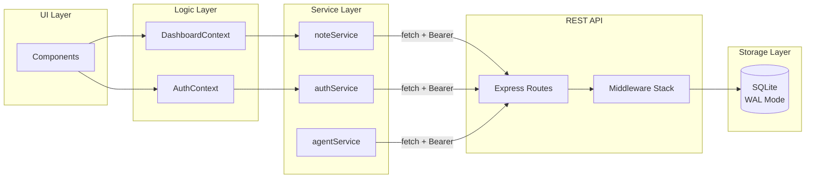
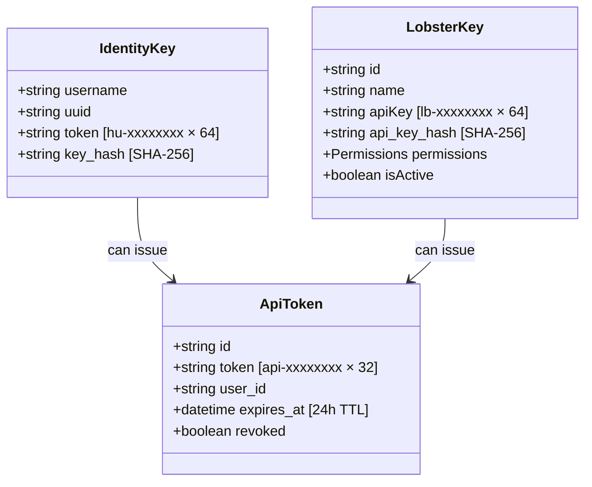
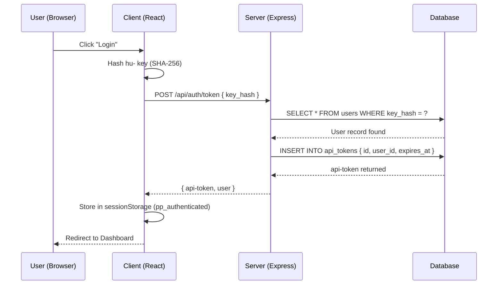

# 🏗️ System Blueprint: PinchPad

[](#)
[](#)

> ASCII Construction Blueprint — the authoritative structural reference for PinchPad.

---

## Full Directory Tree

```text
PinchPad/
│
├── 📄 index.html                    # Vite HTML entry point
├── 📄 package.json                  # NPM dependencies & scripts
├── 📄 vite.config.ts                # Vite bundler config
├── 📄 tsconfig.json                 # TypeScript strict rules
├── 📄 tailwind.config.js            # Design token system
├── 📄 postcss.config.js             # CSS processor pipeline
├── 📄 .env.example                  # Environment variable reference
│
├── 🐳 Dockerfile                    # Single-container image (Node 22 slim)
├── 🐳 docker-compose.yml            # Prod: pull from GHCR
├── 🐳 docker-compose.dev.yml        # Dev: build locally
│
├── 🌐 server.ts                     # TypeScript entry point (Express REST API)
│                                     Wiring: routes, middleware, healthcheck
│
├── src/
│   ├── server/                      # ◀ Backend Source (Express + SQLite)
│   │   ├── db.ts                    # Schema definition, migrations, singleton
│   │   ├── middleware/              # Auth gates, error handling
│   │   │   ├── requireAuth.ts       # Bearer token validation
│   │   │   ├── requirePermission.ts # Permission enforcement
│   │   │   ├── requireHuman.ts      # Human-only gate (blocks lb- keys)
│   │   │   └── errorHandler.ts      # Standardized error responses
│   │   ├── routes/                  # API endpoint definitions
│   │   │   ├── auth.ts              # /api/auth/* endpoints
│   │   │   ├── notes.ts             # /api/notes/* endpoints (CRUD)
│   │   │   └── agents.ts            # /api/agents/* endpoints (lb- management)
│   │   └── utils/                   # Helper functions
│   │       ├── crypto.ts            # Token generation, SHA-256 hashing
│   │       ├── tokenExpiry.ts       # Session management
│   │       └── validation.ts        # Input sanitization
│   │
│   ├── 📄 main.tsx                  # React mount point
│   ├── 📄 App.tsx                   # Root view controller + session state
│   │                                  sessionStorage: pp_authenticated, pp_user
│   ├── 📄 index.css                 # Global styles + Tailwind CSS directives
│   │
│   ├── components/                  # Feature-scoped UI (React)
│   │   ├── auth/
│   │   │   ├── LoginForm.tsx        # Identity file upload + key validation
│   │   │   └── SetupWizard.tsx      # First-run: username, UUID, key generation
│   │   ├── dashboard/
│   │   │   ├── DashboardLayout.tsx  # Main layout: header, sidebar, content
│   │   │   ├── NoteGrid.tsx         # Responsive note card grid
│   │   │   ├── NoteModal.tsx        # Add/Edit note form
│   │   │   └── Sidebar.tsx          # Navigation + filter sidebar
│   │   ├── notes/
│   │   │   ├── NoteEditor.tsx       # Rich note editing
│   │   │   └── NoteViewer.tsx       # Read-only view with decryption
│   │   ├── agents/
│   │   │   ├── AgentList.tsx        # LobsterKey list + management
│   │   │   └── AgentModal.tsx       # Create/edit lb- key with permissions
│   │   ├── settings/
│   │   │   ├── SettingsPanel.tsx    # Settings tabbed layout
│   │   │   └── ProfileSettings.tsx  # Display name, theme, auth info
│   │   ├── layout/
│   │   │   └── MoltTheme.tsx        # View Transition dark mode toggle
│   │   └── ui/                      # shadcn/ui base components
│   │       ├── button.tsx
│   │       ├── card.tsx
│   │       ├── input.tsx
│   │       └── modal.tsx
│   │
│   ├── context/                     # React Context providers
│   │   ├── AuthContext.tsx          # Current user + auth state
│   │   └── DashboardContext.tsx     # Notes, UI state, data operations
│   │
│   ├── services/                    # Business logic & API calls
│   │   ├── authService.ts           # Key generation, verification, login
│   │   ├── noteService.ts           # Note CRUD via REST API
│   │   ├── agentService.ts          # LobsterKey CRUD via REST API
│   │   └── types/                   # Shared TypeScript interfaces
│   │
│   ├── lib/                         # Utilities
│   │   ├── crypto.ts                # SHA-256, AES-256-GCM, UUID generation
│   │   └── utils.ts                 # Helpers
│   │
│   └── types/                       # App-wide TypeScript types
│       └── index.ts                 # Shared type definitions
│
├── test/                            # Test suite (140 tests, Vitest 4.1.0)
│   ├── server/
│   │   ├── routes/
│   │   │   ├── auth.lobster.test.ts
│   │   │   ├── notes.lobster.test.ts
│   │   │   └── agents.lobster.test.ts
│   │   └── middleware/
│   │       └── requireAuth.lobster.test.ts
│   ├── services/
│   │   ├── authService.lobster.test.ts
│   │   ├── noteService.lobster.test.ts
│   │   └── agentService.lobster.test.ts
│   ├── lib/
│   │   └── crypto.lobster.test.ts
│   └── shared/
│       ├── setup.lobster.ts         # Vitest setup + fixtures
│       └── app.ts                   # createTestApp() factory (in-memory SQLite)
│
├── data/                            # SQLite database persistence (Docker volume)
│   └── clawstack.db                 # Encrypted notes, tokens, agent keys
│
└── .crustagent/                     # CrustAgent™ project knowledge & skills
    ├── vibecheck/truthpack/         # Project truth validation
    │   ├── blueprint.json
    │   ├── routes.json
    │   ├── security.json
    │   ├── test-suite.json
    │   └── env.json
    └── knowledge/                   # Project documentation
        └── ClawChives-Docs-Reference/  # Reference template structure
```

---

## Data Flow



---

## Port Map (Dev vs. Prod)

### Development (npm run scuttle:dev-start)
```
┌─────────────────────────────────┐
│   Browser                       │
│   http://localhost:8282         │
│   (Vite dev server)             │
└────────────┬────────────────────┘
             │
             ├─ fetch /api/* ──────┐
             │                    │
             │  ┌─────────────────┴────────────┐
             │  │  Express Server              │
             │  │  http://localhost:8383       │
             │  │  (tsx watch mode)            │
             │  │                              │
             │  │  ┌────────────────────────┐  │
             │  │  │   SQLite (db.ts)       │  │
             │  │  │   ./data/clawstack.db  │  │
             │  │  └────────────────────────┘  │
             │  └──────────────────────────────┘
             │
             └─ requests cors: http://localhost:8282 ✅
```

### Production (Docker: docker compose up -d)
```
┌──────────────────────────────────┐
│   Host System                    │
│   Port 8282:8282 → Container    │
└────────────┬─────────────────────┘
             │
    ┌────────┴────────┐
    │                 │
    ▼                 ▼
┌────────────────────────────────┐
│   Docker Container             │
│   (Single image, unified port) │
│                                │
│   ┌──────────────────────────┐ │
│   │  Express Server          │ │
│   │  :8282 (production)      │ │
│   │                          │ │
│   │  - Serves dist/ (React)  │ │
│   │  - Handles /api/*        │ │
│   │                          │ │
│   │  ┌────────────────────┐  │ │
│   │  │   SQLite           │  │ │
│   │  │   /app/data/       │  │ │
│   │  │   clawstack.db     │  │ │
│   │  └────────────────────┘  │ │
│   └──────────────────────────┘ │
└────────────────────────────────┘
     │
     └─ health: /api/health ✅
```

---

## Database Schema

```
┌──────────────────────────────────────────┐
│            users                         │
├──────────────────────────────────────────┤
│ id (TEXT, PK)                            │
│ username (TEXT, UNIQUE)                  │
│ key_hash (TEXT, UNIQUE, SHA-256)         │
│ created_at (TEXT, ISO8601)               │
└──────────────────────────────────────────┘
         │
         ├─ FK ──────────────────────┐
         │                           │
┌────────▼───────────┐  ┌──────────▼──────────┐
│   api_tokens       │  │   lobster_keys      │
├────────────────────┤  ├─────────────────────┤
│ id (TEXT, PK)      │  │ id (TEXT, PK)       │
│ token (TEXT)       │  │ name (TEXT)         │
│ user_id (FK)       │  │ api_key_hash (TEXT) │
│ created_at (TEXT)  │  │ permissions (JSON)  │
│ expires_at (TEXT)  │  │ user_id (FK)        │
│ revoked (BOOL)     │  │ created_at (TEXT)   │
└────────────────────┘  │ revoked (BOOL)      │
         │              └─────────────────────┘
         │
         └─ FK ──────────┐
                        │
          ┌─────────────▼──────────┐
          │       notes            │
          ├────────────────────────┤
          │ id (TEXT, PK)          │
          │ title (TEXT)           │
          │ content (BLOB, AES-256)│
          │ user_id (FK)           │
          │ created_at (TEXT)      │
          │ updated_at (TEXT)      │
          └────────────────────────┘

Key Constraints:
- ON DELETE CASCADE for all FKs (user → tokens, keys, notes)
- UNIQUE constraints on username, key_hash
- WAL mode enabled for durability
- Foreign keys enforced (PRAGMA foreign_keys=ON)
```

---

## Architectural Tenets

<details>
<summary>View Core Principles</summary>

1. **Separation of Concerns** — Components display. Services handle data. Middleware gates auth. Routes orchestrate.
2. **Feature First** — All directories are nested by feature area (auth, dashboard, notes). No flat generic soup.
3. **No Monoliths** — Files are single-responsibility. Growing files signal refactoring time.
4. **Auth is Always Tiered** — Immutable stack: `requireAuth` → `requirePermission` → `requireHuman`.
5. **Identity Keys Never Leave Client** — `hu-` hashed SHA-256 on client before transmission.
6. **One-Field Login** — Users can login using only their `hu-` key. Server performs lookup via UNIQUE `key_hash` index.
7. **Explicit State** — Auth and navigation state persisted in `sessionStorage` with namespaced keys (`pp_*`).
8. **ShellCryption Lock** — All note content is encrypted AES-256-GCM at rest. Decryption is client-side only.
9. **Visual UI Lock-in** — The current interface layout is final. All future components must adhere to established spatial hierarchy.
10. **Testing as Gate** — All 140 tests must pass. `.lobster.test.ts` naming enforced. `createTestApp()` factory prevents pollution.

</details>

---

## Key System



---

## Authentication Flow



---

## Test Architecture

```
test/
├── server/                          # Backend integration tests
│   ├── routes/
│   │   ├── auth.lobster.test.ts     # Auth endpoints (register, token, verify, logout)
│   │   ├── notes.lobster.test.ts    # Note CRUD endpoints (GET, POST, PUT, DELETE)
│   │   └── agents.lobster.test.ts   # Agent key endpoints (GET, POST, PUT /revoke)
│   └── middleware/
│       └── requireAuth.lobster.test.ts  # Auth middleware validation
│
├── services/                        # Service unit tests
│   ├── authService.lobster.test.ts  # Key generation, hashing
│   ├── noteService.lobster.test.ts  # Note operations
│   └── agentService.lobster.test.ts # Agent key operations
│
├── lib/
│   └── crypto.lobster.test.ts       # Crypto utilities (SHA-256, AES-256-GCM, UUID)
│
└── shared/
    ├── setup.lobster.ts             # Vitest configuration, fixtures, helpers
    └── app.ts                       # createTestApp() factory function
                                      Returns: { app: Express, db: Database }
                                      DB: :memory: SQLite (zero pollution)

Test Statistics:
- 140 tests total
- 9 files
- Vitest 4.1.0
- Coverage: Middleware 100%, Routes avg 79%, Overall 56.84%
- Running: npm test (non-watch), npm run test:watch, npm run test:coverage
```

---

*Maintained by CrustAgent©™*
