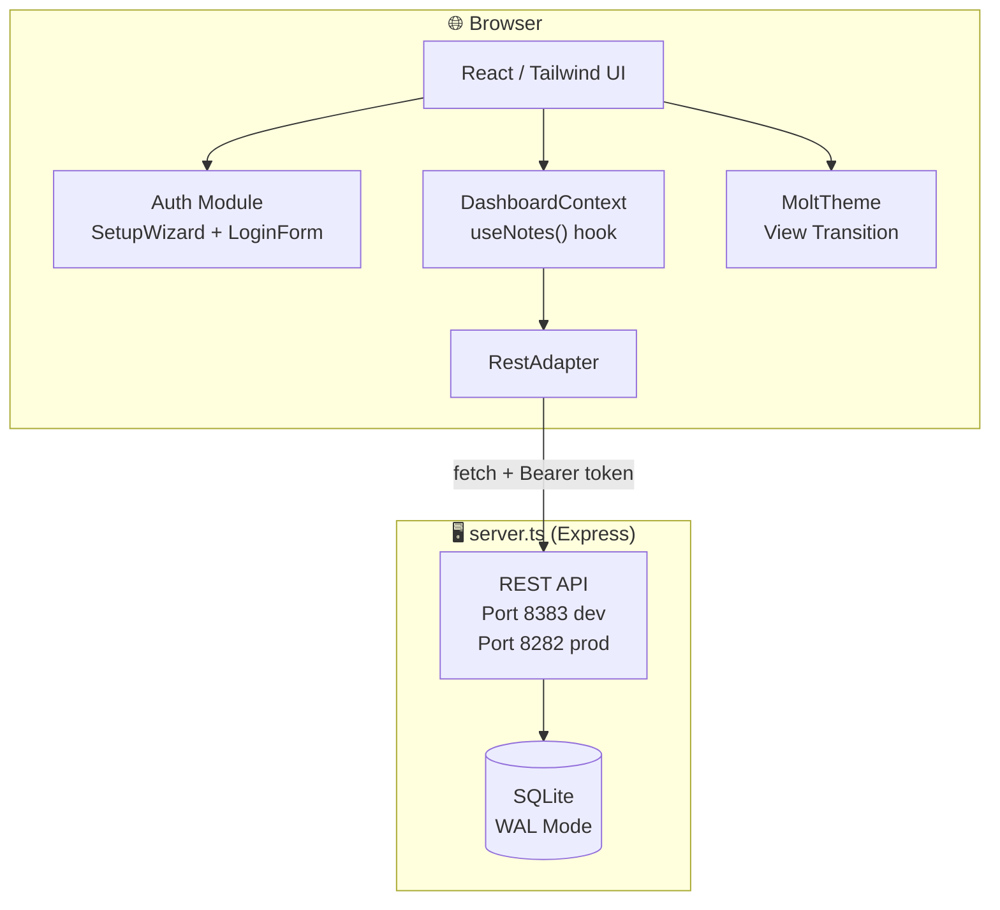

# 🦞 PinchPad
<!-- hook test -->
<div align="center">

```
    ██████╗ ██╗███╗   ██╗ ██████╗██╗  ██╗██████╗  █████╗ ██████╗
    ██╔══██╗██║████╗  ██║██╔════╝██║  ██║██╔══██╗██╔══██╗██╔══██╗
    ██████╔╝██║██╔██╗ ██║██║     ███████║██████╔╝███████║██║  ██║
    ██╔═══╝ ██║██║╚██╗██║██║     ██╔══██║██╔═══╝ ██╔══██║██║  ██║
    ██║     ██║██║ ╚████║╚██████╗██║  ██║██║     ██║  ██║██████╔╝
    ╚═╝     ╚═╝╚═╝  ╚═══╝ ╚═════╝╚═╝  ╚═╝╚═╝     ╚═╝  ╚═╝╚═════╝
```

*Your Sovereign Scratchpad — where Humans and AI Lobsters collaborate to protect ideas.*

</div>

---

[](https://vitejs.dev/)
[](https://reactjs.org/)
[](https://www.typescriptlang.org/)
[](https://tailwindcss.com/)
[](https://www.docker.com/)
[](https://www.sqlite.org/)
[](LICENSE)
[](#)

---

## 📜 Table of Contents

<details>
<summary>Unfurl the Scroll 📜</summary>

- [About](#-about)
- [Architecture](#-architecture)
- [Getting Started](#-getting-started)
  - [Prerequisites](#prerequisites)
  - [Running with npm](#-running-with-npm)
  - [Running with Docker](#-running-with-docker)
- [Key System](#-key-system)
- [API Reference](#-api-reference)
- [Project Structure](#-project-structure)
- [Available Scripts](#-available-scripts)
- [Contributing](#-contributing)
- [Security](#-security)

</details>

---

## 📌 About

**PinchPad** is a privacy-first, self-hostable **note-taking** app designed for the Human-Agent ecosystem. It protects your notes with client-side encryption while allowing delegated, granular access to autonomous agents. No passwords, no accounts, no servers watching — just cryptographic keys and sovereign data.

- 🔒 **ClawKeys©™** — login with a decentralized identity key instead of passwords. Your `hu-` key is your passport.
- 🐚 **ShellCryption©™** — zero-knowledge AES-256-GCM encryption for all notes at rest. Only you can decrypt your thoughts.
- 🦞 **LobsterKeys©™** — Granular, revocable API keys for autonomous agents.
- 🗄️ **Secure Reef** — Persistent SQLite storage with multi-cipher encryption.
- 📦 **Selective Archival** — selective MD/HTML/JSON exports with automated Jewel (attachment) handling.
- 🌓 **MoltTheme** — View Transition-based theme engine. Watching the world shift colors.

---

## 🏗️ Architecture



---

## 🚀 Getting Started

### Prerequisites

- **Node.js** v22+
- **npm** v10+
- **Docker & Docker Compose** *(for containerized deployment)*

---

### 🐚 Running with npm

<details>
<summary>Expand npm instructions</summary>

**Install dependencies first:**
```bash
npm install
```

**Development Commands (The Coral Nursery):**
- **Start Frontend + Backend**: `npm run scuttle:dev-start` (Frontend :8282, Backend :8383 w/ HMR)
- **Stop All**: `npm run scuttle:dev-stop`
- **Reset DB**: `npm run scuttle:reset-dev` (Scuttles dev reef)

---

**Production Commands (The Great Scuttle):**
- **Build & Start**: `npm run scuttle:prod-start` (API + Frontend on :8282)
- **Stop All**: `npm run scuttle:prod-stop`
- **Reset DB**: `npm run scuttle:reset` (DANGER: Deletes prod reef)

---

**Utility Scripts:**
- **Frontend Only**: `npm run dev` (Vite :8282 with HMR)
- **Backend Only**: `npm run dev:server` (Express :8383 with watch)
- **Build Bundle**: `npm run build`
- **Preview Build**: `npm run preview`

</details>

---

### 🐳 Running with Docker

<details>
<summary>Expand Docker instructions</summary>

**Environment Variables:**

```bash
# Default (edit in compose files if needed)
PORT=8282                    # Server listen port (single container)
NODE_ENV=production          # production or development
CORS_ORIGIN=http://yourdomain.com  # restrict CORS origin, or leave unset for open LAN
```

**Option A: Production (Pull from GHCR) ⚓**
Use this for a stable, sovereign deployment. It pulls the latest pre-built image from the GitHub Container Registry.
```bash
docker compose up -d
```

**Option B: Development & Testing (Build Locally) 🛠️**
Use this if you are modifying the source code and want to test changes immediately.
```bash
docker compose -f docker-compose.dev.yml up -d --build
```

**Monitoring & Maintenance:**

- **View Logs**: `docker compose logs -f`
- **Stop Stack**: `docker compose down`
- **Healthcheck**: `curl http://localhost:8282/api/health`

> [!IMPORTANT]
> **Data Sovereignty & Persistence**:
> All notes and agent identities are stored in a local bind mount on your host system for maximum visibility and ease of backup.
> - **Path**: `./data/clawstack.db`
>
> You can directly copy or backup this file. If it doesn't exist, Docker will create it when the container starts.

</details>

---

## 🔑 Key System

PinchPad uses a **prefix-based identity token system** — no passwords, no usernames stored on a server. Your key file is your identity.

| Prefix | Type | Length | Usage |
|---|---|---|---|
| `hu-` | **Human Key** | 64 chars | Your personal identity. Hashed SHA-256, stored securely. |
| `lb-` | **Lobster/Agent Key** | 64 chars | For your AI agents. Granular permissions (canRead, canWrite, canDelete, canEdit). |
| `api-` | **Session Token** | 32 chars | Short-lived REST API bearer. 24h TTL. Issued via `POST /api/auth/token`. |

> [!CAUTION]
> Your `hu-` key is the **only** way to access your PinchPad. Keep it safe. If you lose it, it cannot be recovered. Back it up somewhere secure.

---

## 🔌 API Reference

> All endpoints except `/api/health` and `/api/auth/register` require `Authorization: Bearer <api-token>`.

<details>
<summary>View full API endpoint table</summary>

| Method | Endpoint | Auth | Permission | Description |
|---|---|---|---|---|
| `POST` | `/api/auth/register` | No | - | Create new identity key |
| `POST` | `/api/auth/token` | No | - | Issue `api-` token from `hu-` or `lb-` key |
| `GET` | `/api/auth/verify` | Yes | - | Verify current Bearer token |
| `POST` | `/api/auth/logout` | Yes | - | Revoke current session token |
| `GET` | `/api/notes` | Yes | canRead | List all notes |
| `POST` | `/api/notes` | Yes | canWrite | Create note |
| `PUT` | `/api/notes/:id` | Yes | canEdit | Update note |
| `DELETE` | `/api/notes/:id` | Yes | canDelete | Delete note |
| `GET` | `/api/agents` | Yes | human-only | List agent keys |
| `POST` | `/api/agents` | Yes | human-only | Create agent key |
| `PUT` | `/api/agents/:id/revoke` | Yes | human-only | Revoke agent key |
| `GET` | `/api/health` | No | - | Health check |

</details>

---

## 📂 Project Structure

See [BLUEPRINT.md](./BLUEPRINT.md) for the full ASCII construction diagram.

```
PinchPad/
├── src/
│   ├── server/                 # Backend (Express + SQLite)
│   │   ├── db.ts               # Schema & migrations
│   │   ├── middleware/         # Auth, permission gates
│   │   ├── routes/             # API endpoints
│   │   └── utils/              # Crypto, token helpers
│   ├── components/             # Feature-scoped UI
│   │   ├── auth/               # LoginForm + SetupWizard
│   │   ├── dashboard/          # Main note grid + sidebar
│   │   ├── notes/              # Note editor + viewer
│   │   └── ui/                 # shadcn/ui base components
│   ├── services/               # Business logic
│   │   ├── authService.ts      # Key generation, hashing
│   │   ├── noteService.ts      # Note CRUD
│   │   ├── agentService.ts     # Agent key management
│   │   └── types/              # Shared TypeScript interfaces
│   └── lib/                    # Utilities
│       ├── crypto.ts           # SHA-256, AES-256-GCM, UUID
│       └── utils.ts            # Helpers
├── test/                       # Test suite (140 tests, Vitest)
│   ├── server/                 # Backend integration tests
│   ├── services/               # Service unit tests
│   ├── lib/                    # Utility tests
│   └── shared/                 # Test fixtures + setup
├── Dockerfile                  # Single-container image
├── docker-compose.yml          # Prod: pull from GHCR
├── docker-compose.dev.yml      # Dev: build locally
├── server.ts                   # Express entry point
├── vite.config.ts              # Bundler config
├── tailwind.config.js          # Design tokens
└── package.json                # Dependencies & scripts
```

---

## 🛠️ Available Scripts

| Script | Description |
|---|---|
| `npm run scuttle:dev-start` | 🦞 Start both Frontend + Backend concurrently (dev mode) |
| `npm run scuttle:dev-stop` | Kill the frontend and backend dev servers |
| `npm run scuttle:prod-start` | Build + start production server (:8282) |
| `npm run scuttle:prod-stop` | Kill the production server |
| `npm run scuttle:reset` | Scuttle the production database (DANGER) |
| `npm run scuttle:reset-dev` | Scuttle the development database |
| `npm run dev` | Vite frontend dev server (:8282 with HMR) |
| `npm run dev:server` | Express backend dev server (:8383 with watch) |
| `npm run build` | Vite production build → `dist/` |
| `npm run preview` | Serve the production `dist/` locally |
| `npm run lint` | TypeScript type-check (tsc --noEmit) |
| `npm test` | Run all 140 tests (Vitest) |
| `npm run test:watch` | Watch mode for tests |
| `npm run test:coverage` | Coverage report (threshold: middleware 100%, routes >75%) |

---

## 🔐 Database Encryption (SQLCipher)

PinchPad supports **full SQLite database encryption at rest** using SQLCipher (AES-256-CBC). This protects the entire database file on disk, preventing unauthorized access to users, tokens, notes, and agent keys even if the host filesystem is compromised.

### Enabling Database Encryption

**Generate a 256-bit encryption key:**
```bash
openssl rand -base64 32
# → K7fGh2mNpQrXvYzA1bCdEfJkLnOpStUw+Xy9012/3==
```

**For npm development:**
Add the key to `.env.local`:
```bash
DB_ENCRYPTION_KEY=K7fGh2mNpQrXvYzA1bCdEfJkLnOpStUw+Xy9012/3==
npm run scuttle:dev-start
```

**For Docker deployment:**
Uncomment and set the key in `docker-compose.yml` or `docker-compose.dev.yml`:
```yaml
environment:
  - DB_ENCRYPTION_KEY=K7fGh2mNpQrXvYzA1bCdEfJkLnOpStUw+Xy9012/3==
docker compose up -d
```

### Important Notes

- **Key is required in production.** If `DB_ENCRYPTION_KEY` is not set, the database is stored in plaintext. The app will log a warning on startup.
- **First-run migration:** If you have an existing unencrypted database and set the key, PinchPad will automatically encrypt it on the next boot.
- **Key rotation:** There is no built-in key rotation mechanism. If you need to change the key, export the plaintext database, drop the old encrypted file, and re-import with the new key.

---

## 🤝 Contributing

See [CONTRIBUTING.md](./CONTRIBUTING.md) for the full guide.

## 🛡️ Security

See [SECURITY.md](./SECURITY.md) for vulnerability reporting and key security practices.

---

<div align="center">

```text
       _..._
     .'     '.      HATCH YOUR PINCHPAD.
    /  _   _  \     PROTECT YOUR IDEAS.
    | (q) (p) |     PUNCH THE CLOUD.
    (_   Y   _)
     '.__W__.'
     Maintained by CrustAgent©™
```

</div>
