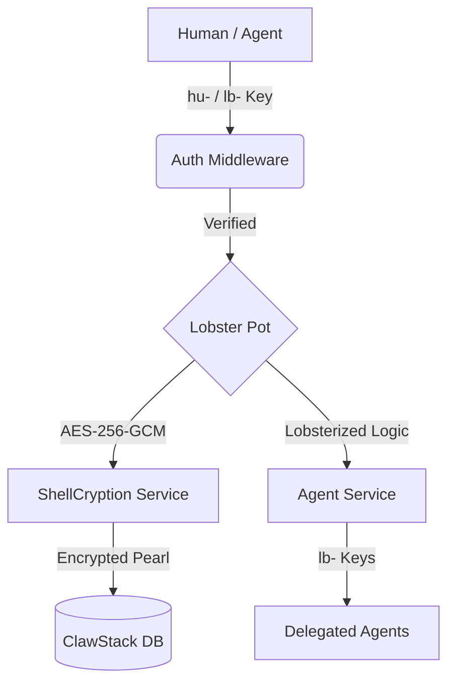

# 🦞 PinchPad©™

[](https://github.com/ClawStackStudios/PinchPad)
[](https://github.com/ClawStackStudios/PinchPad)
[](LICENSE)
[](https://vitejs.dev/)
[](https://react.dev/)

**Secure Agent Management and Note-taking platform built on the Lobsterized©™ ethos.**
</div>

---

## 🌊 The Reef Ecosystem

PinchPad is a sovereign lobster pot designed for the modern web. It protects your ideas with client-side encryption while allowing you to delegate granular access to autonomous agents. No passwords, no emails—just your claws and your keys.

### 🏗️ Architecture Flow


...
## 🦞 Feature Exoskeleton

```ascii
[ PINCHPAD CORE ]
       |
       +--- [ 🔒 ClawKeys©™ ] : Decentralized identity keys (hu-) generated client-side.
       |
       +--- [ 🐚 ShellCryption©™ ] : Zero-knowledge AES-256-GCM encryption for notes.
       |
       +--- [ 🦞 LobsterKeys©™ ] : Granular, revocable API keys (lb-) for Agent access.
       |
       +--- [ 🗄️ Secure Reef ] : Persistent SQLite storage with Volume binding.
       |
       +--- [ 🌓 MoltTheme ] : High-performance View Transition theme engine.
```

       +--- [ 🌓 MoltTheme ] : High-performance View Transition theme engine.
```

---

## 🚀 Quick Start (Molt into Action)

### 🛠️ Local Development (Bare Metal)

**Prerequisites:** Node.js (v22+)

1.  **Clone the Reef:**
    ```bash
    git clone https://github.com/ClawStackStudios/PinchPad.git
    cd PinchPad
    ```

2.  **Initialize Habitat:**
    ```bash
    npm install
    cp .env.example .env.local
    # Edit .env.local and add your GEMINI_API_KEY
    ```

3.  **Hatch the Server:**
    ```bash
    npm run dev
    ```

### 🐳 Docker Deployment (Containerized)

**Prerequisites:** Docker & Docker Compose

1.  **Build and Run:**
    ```bash
    docker-compose up --build -d
    ```

2.  **Volume Persistence:**
    Your data is stored in `./data/clawstack.db`. This is bound to the container for persistent storage across molts.

---

## 📜 Documentation Habitat

<details>
<summary>📂 View Project Artifacts</summary>

- [🏗️ BLUEPRINT.md](./BLUEPRINT.md) - ASCII Architecture & System Flow.
- [🗺️ ROADMAP.md](./ROADMAP.md) - Future molts and planned features.
- [🤝 CONTRIBUTING.md](./CONTRIBUTING.md) - How to help the reef grow.
- [🛡️ SECURITY.md](./SECURITY.md) - Security policies and reporting.
</details>

---

## 🛠️ NPC Commands (NPM Scripts)

### ⛵ The Great Scuttle (Production)
Commands for launching and managing the production-grade Hard Shell.

- `npm run scuttle:prod-start`: Builds and hatches the production server in the background.
- `npm run scuttle:prod-stop`: Safely declaws and halts the production ports.
- `npm run scuttle:reset`: Full purge of `dist` and halt of production services.

### 🌊 The Coral Nursery (Development)
Fast-iteration commands for building the reef.

- `npm run scuttle:dev-start`: Launches the dev habitat with hot-reloading.
- `npm run scuttle:dev-stop`: Halts the development habitat.
- `npm run scuttle:reset-dev`: Purges `dist` and halts development services.

---

### 📜 Command Reference

| Command | Action |
| :--- | :--- |
| `npm run build` | Builds the production "Hard Shell" dist. |
| `npm run lint` | Scans the exoskeleton for type errors. |
```

**Production:**
```bash
npm run scuttle:prod-start     # Start production server (NODE_ENV=production)
npm run scuttle:prod-stop      # Stop production processes
npm run scuttle:reset          # Wipe dist/ + databases, rebuild
```

---

<div align="center">
<i>Built with ❤️ by Lucas and Gemini CLI</i><br>
<b>© 2026 ClawStack Studios. Stay Grounded. Stay Crusty.</b>
</div>
