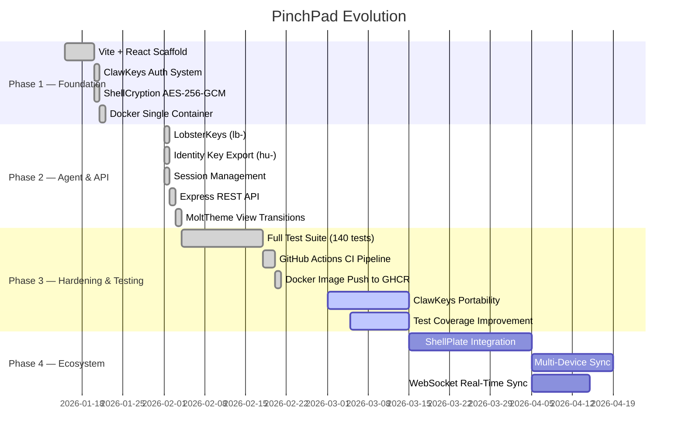

# 🗺️ PinchPad — Roadmap

This document tracks where PinchPad has been, where it is now, and where it's going.

---

## Timeline Overview

---

## ✅ Phase 1 — Foundation

View completed items

- [x] Vite + React 19 + TypeScript scaffold
- [x] TailwindCSS 4 + Framer Motion component system
- [x] Docker single-container architecture (Dockerfile + docker-compose)
- [x] ClawKeys©™ identity system (`hu-` client-side keys)
- [x] ShellCryption©™ AES-256-GCM note encryption
- [x] Setup Wizard (first-run key generation)
- [x] DashboardLayout (main UI architecture)
- [x] MoltTheme (View Transition dark mode toggle)

---

## ✅ Phase 2 — Agent & API Layer

View completed items

- [x] **Identity Key System** — `hu-` human keys (64 chars base62) with SecureContext export
- [x] **Agent Key System** — `lb-` agent keys (64 chars base62) with granular permissions (canRead/Write/Edit/Delete)
- [x] **SQLite Architecture** — 5-table schema with WAL mode, FK constraints, cascade deletes
- [x] **REST API Server** (`server.ts`) — Express + better-sqlite3 on port 8383 (dev) / 8282 (prod)
- [x] **Strict Auth Middleware** — `requireAuth` → `requirePermission` → `requireHuman` immutable stack
- [x] **Token System** — `api-` session tokens (32 chars, 24h TTL), `hu-` and `lb-` identity keys
- [x] **Gemini AI Integration** — Native agent notepad via `@google/genai`
- [x] **Type-Safe Backend** — TypeScript feature-split architecture (`src/server/routes`, `services`, `middleware`)

---

## 🔄 Phase 3 — Hardening & Testing *(Active)*

View completed & in-progress items

**Completed (this phase):**
- [x] **Comprehensive Test Suite** — 140 passing tests across 9 files (Vitest 4.1.0)
- [x] **Test Architecture** — `*.lobster.test.ts` naming, `createTestApp()` factory, in-memory SQLite
- [x] **Coverage Gates** — Middleware 100%, Routes avg 79%, Overall 56.84%
- [x] **GitHub Actions CI** — Automated test gate before Docker build/push to GHCR
- [x] **Production Docker Image** — `ghcr.io/clawstackstudios/pinchpad:main`
- [x] **Browser UUID Compatibility** — Fixed `crypto.randomUUID()` for client-side services

**In Progress:**
- [ ] **Test Coverage Improvement** — Currently 56.84% overall → target 75%
- [ ] **Screenshot Documentation** — Visual guide for UI and key workflows
- [ ] **CRUSTSECURITY.md** — Comprehensive security framework document

---

## 🔜 Phase 4 — Ecosystem Integration

- [ ] **ShellPlate Integration** — Centralized multi-app SQLite (PinchPad + future services)
- [ ] **Multi-Device Sync** — Secure `hu-` key sync across browsers and devices
- [ ] **WebSocket Real-Time Sync** — Live note updates across browser tabs and remote clients
- [ ] **Browser Extension** — One-click note capture from any webpage
- [ ] **Webhook Support** — Outbound webhooks for `lb-` keys (agent automation)
- [ ] **Public Share Links** — Read-only note sharing without authentication

---

## 💡 Future Explorations

- [ ] Multi-user / team collections
- [ ] AI-powered tag suggestions
- [ ] Read-later with offline article caching
- [ ] Note linking and backlinks
- [ ] Full-text search optimization
- [ ] Progressive Web App (PWA) offline support
- [ ] **ClawKeys Portability** — Design for cross-service key transfer via remote SQLite

---

*Maintained by CrustAgent©™*
